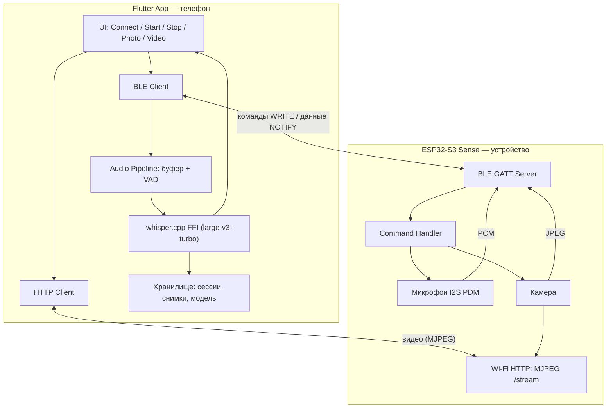
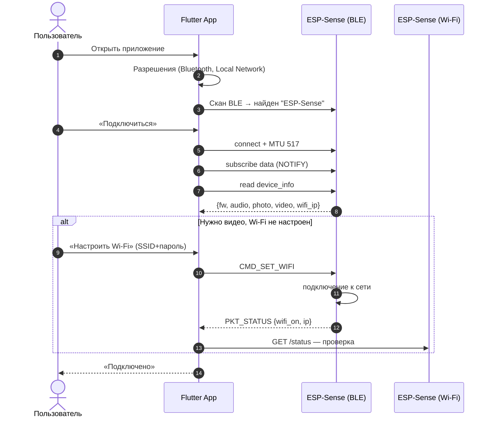
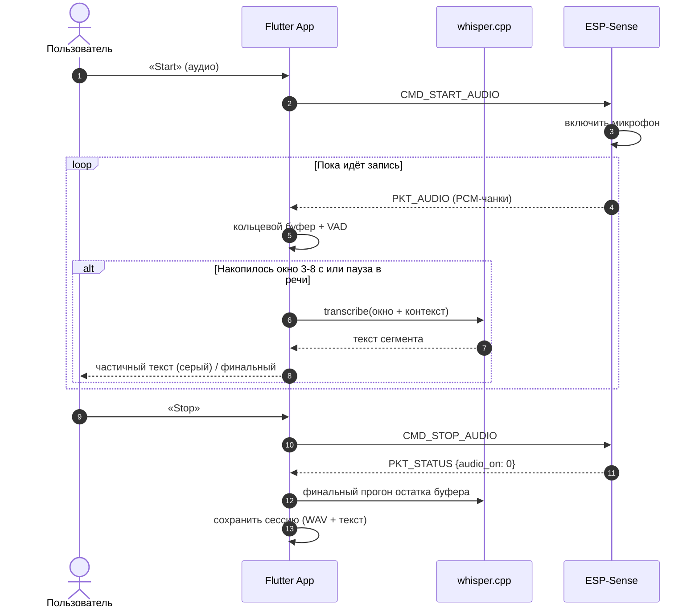
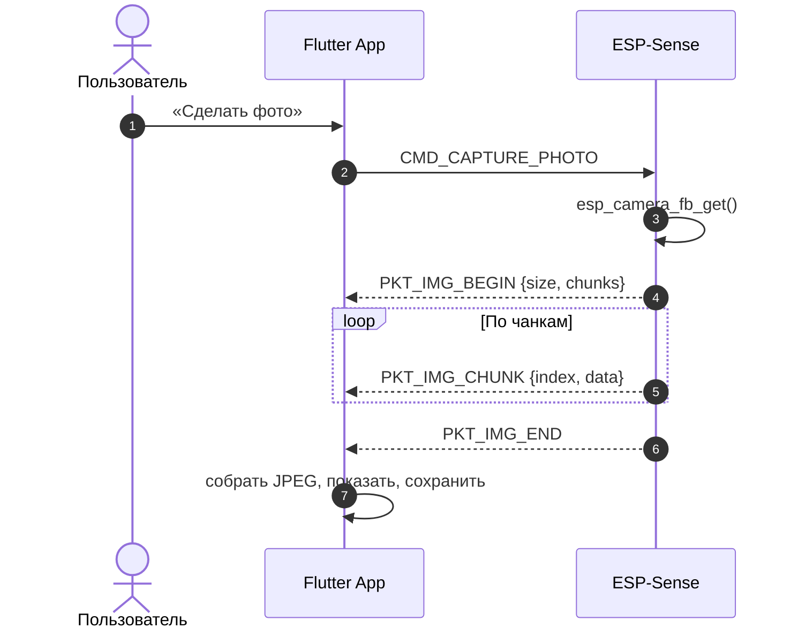
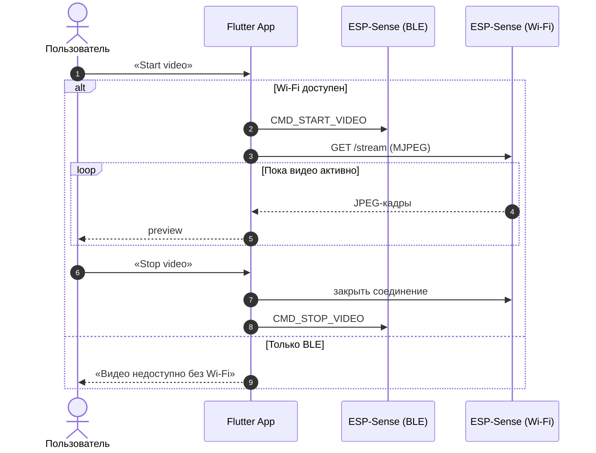
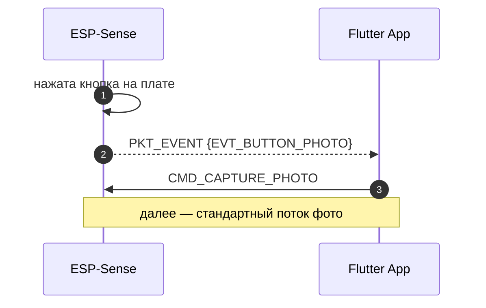
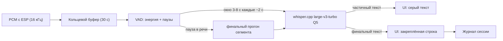

# Архитектура ESP Sense

Система из двух частей:

- **Устройство** — XIAO ESP32-S3 Sense (камера OV2640/OV3660, PDM-микрофон, BLE 5.0, Wi-Fi).
- **Мобильное приложение** — Flutter (iOS + Android): подключение, управление, приём данных, локальная расшифровка речи (whisper.cpp).

Принцип: **устройство максимально простое** (захват и передача), **вся обработка на телефоне** (порог громкости, VAD, Whisper, дальнейшая логика).

## Слои системы



## Транспорты

| Данные | BLE | Wi-Fi |
|--------|-----|-------|
| Команды (start/stop/photo) | основной канал | — |
| Аудио PCM 16 кГц | основной канал | возможно в будущем |
| Фото JPEG (по запросу) | чанками через NOTIFY | быстрее, если сеть есть |
| Видео MJPEG | нет (не хватает полосы) | единственный вариант |
| События с кнопок устройства (будущее) | NOTIFY | — |

Wi-Fi опционален: плата и телефон в одной сети, либо телефон раздаёт hotspot и
плата подключается к нему (провижининг по BLE командой `CMD_SET_WIFI`).
У ESP нет своей SIM — «мобильная сеть» возможна только через hotspot телефона
или облачный relay (задел на будущее).

## GATT-спецификация

### Сервис

| | UUID |
|---|---|
| Service | `a1b2c300-1111-2222-3333-444455556666` |
| `data` (NOTIFY) | `a1b2c300-1111-2222-3333-444455556667` |
| `commands` (WRITE) | `a1b2c300-1111-2222-3333-444455556668` |
| `device_info` (READ) | `a1b2c300-1111-2222-3333-444455556669` |

Имя устройства в рекламе: **`ESP-Sense`**. MTU: устройство запрашивает 517.

### Команды (характеристика `commands`, WRITE)

Первый байт — опкод, дальше — полезная нагрузка (little-endian).

| Опкод | Имя | Payload | Действие |
|-------|-----|---------|----------|
| `0x10` | `CMD_START_AUDIO` | — | Начать стрим аудио (пакеты `0x01`) |
| `0x11` | `CMD_STOP_AUDIO` | — | Остановить стрим аудио |
| `0x20` | `CMD_CAPTURE_PHOTO` | — | Снять кадр, отправить пакетами `0x02..0x04` |
| `0x30` | `CMD_START_VIDEO` | — | Зарезервировано: включить MJPEG-сервер |
| `0x31` | `CMD_STOP_VIDEO` | — | Зарезервировано |
| `0x40` | `CMD_SET_WIFI` | `ssid_len u8, ssid[], pass_len u8, pass[]` | Провижининг Wi-Fi |
| `0x50` | `CMD_OTA_BEGIN` | зарезервировано | OTA-обновление прошивки (будущее) |

### Пакеты данных (характеристика `data`, NOTIFY)

Первый байт — тип пакета.

| Тип | Имя | Формат |
|-----|-----|--------|
| `0x01` | `PKT_AUDIO` | `[0x01][seq u32][count u16][pcm int16 × count]` |
| `0x02` | `PKT_IMG_BEGIN` | `[0x02][total_size u32][chunk_count u16]` |
| `0x03` | `PKT_IMG_CHUNK` | `[0x03][index u16][bytes ≤180]` |
| `0x04` | `PKT_IMG_END` | `[0x04]` |
| `0x05` | `PKT_EVENT` | `[0x05][event u8]` — кнопки на устройстве (будущее) |
| `0x06` | `PKT_STATUS` | `[0x06][audio_on u8][wifi_on u8][ip u32]` |

Аудио: PCM 16 бит, 16 кГц, моно, little-endian. ~160 сэмплов на пакет.

### `device_info` (READ)

JSON-строка:

```json
{"fw":"2.0.0","name":"ESP-Sense","audio":true,"photo":true,"video":false,"wifi_ip":""}
```

### События устройства (будущее, `PKT_EVENT`)

| Код | Имя |
|-----|-----|
| `0x01` | `EVT_BUTTON_AUDIO_START` |
| `0x02` | `EVT_BUTTON_AUDIO_STOP` |
| `0x03` | `EVT_BUTTON_PHOTO` |
| `0x04` | `EVT_BUTTON_VIDEO_TOGGLE` |

Логика приёма в приложении одинакова: неважно, пришла команда с кнопки UI
или с кнопки устройства — дальше тот же pipeline.

## Диаграммы последовательности

### Подключение



### Аудио и потоковая расшифровка



### Фото



### Видео (Wi-Fi)



### Кнопки на устройстве (будущее)



## Потоковая расшифровка (Whisper)

Whisper не является стриминговой моделью, поэтому применяется псевдо-стриминг:



- Модель: `ggml-large-v3-turbo-q5_0.bin` (~574 МБ), фолбэк `ggml-small` (~488 МБ q5 ~190 МБ).
- Контекст: последние N токенов предыдущего сегмента передаются в prompt — связный текст.
- Задержка: ~1–3 с от речи до финального текста на iPhone 14/15.
- Модель хранится вне бандла приложения и переживает обновления (см. INSTALL.md).

## Обновляемость

1. **Модель Whisper** — скачивается один раз в постоянное хранилище приложения,
   проверяется по SHA-256 из `models.json`. Обновление приложения не трогает модель.
2. **Dart-код** — Shorebird code push: патчи логики без переустановки.
3. **Прошивка ESP** — сейчас по USB (`arduino-cli upload`), в протоколе
   зарезервирован `CMD_OTA_BEGIN` для будущего OTA по BLE/Wi-Fi.
