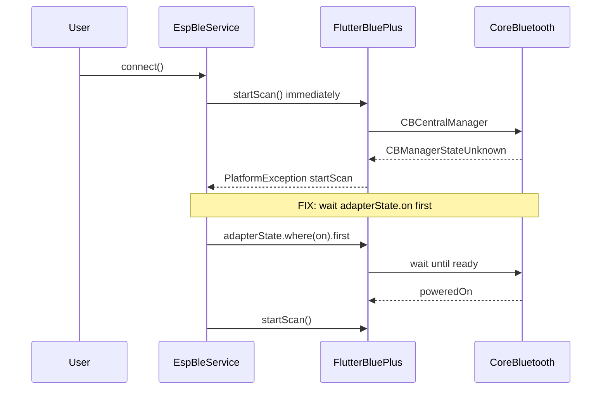

# План: исправление BLE на macOS + логирование

## Диагноз по скриншоту

Ошибка:
```
PlatformException(startScan, bluetooth must be turned on. (CBManagerStateUnknown), null, null)
```

**Причина:** в [`app/lib/services/esp_ble_service.dart`](app/lib/services/esp_ble_service.dart) метод `_scanForDevice()` сразу вызывает `FlutterBluePlus.startScan()`, не дожидаясь готовности Bluetooth-адаптера.

На macOS/iOS `adapterState` **всегда стартует как `unknown`** — это нормально. Документация [flutter_blue_plus](https://pub.dev/packages/flutter_blue_plus): перед сканом нужно дождаться `BluetoothAdapterState.on`.

Entitlements в [`app/macos/Runner/Release.entitlements`](app/macos/Runner/Release.entitlements) настроены верно — проблема в коде, не в конфиге.



---

## Часть 1 — Исправить BLE (корневая причина)

Файл: [`app/lib/services/esp_ble_service.dart`](app/lib/services/esp_ble_service.dart)

Добавить метод `_ensureBluetoothReady()` перед сканом:

1. `FlutterBluePlus.isSupported` — если false, понятная ошибка
2. Ждать `FlutterBluePlus.adapterState.where((s) => s == BluetoothAdapterState.on).first` с таймаутом 10 с
3. Если таймаут — проверить текущее состояние и выдать человекочитаемую ошибку:
   - `unknown` → «Bluetooth ещё инициализируется, попробуйте снова»
   - `off` → «Включите Bluetooth в Системных настройках»
   - `unauthorized` → «Разрешите Bluetooth: Настройки → Конфиденциальность → Bluetooth → ESP Sense»
   - `unsupported` → «Bluetooth недоступен на этом Mac»

Вызвать `_ensureBluetoothReady()` в начале `connect()` и `_scanForDevice()`.

Опционально: на macOS при `unknown` — одна пауза 1 с и повтор (как в README FBP).

---

## Часть 2 — Логирование (чтобы видеть ошибки)

Сейчас логов **нет** — release `.app` не пишет в Terminal.

### 2a. Сервис логов

Новый файл: [`app/lib/services/app_log.dart`](app/lib/services/app_log.dart)

- Singleton `AppLog.instance`
- Методы: `info()`, `warn()`, `error()` с timestamp
- Кольцевой буфер в памяти (последние 200 строк) — для UI
- Запись в файл через `path_provider`:
  `Application Support/esp_sense.log` (в sandbox-контейнере приложения)
- `Stream<List<String>>` для обновления UI

### 2b. Интеграция

- [`app/lib/main.dart`](app/lib/main.dart): `FlutterBluePlus.setLogLevel(LogLevel.verbose)` в debug/profile; в release — `LogLevel.info`
- [`app/lib/services/esp_ble_service.dart`](app/lib/services/esp_ble_service.dart): логи на каждом шаге (adapter state, scan start/stop, connect, notify, errors)
- [`app/lib/screens/connect_screen.dart`](app/lib/screens/connect_screen.dart): человекочитаемые ошибки + кнопка «Показать логи»

### 2c. UI логов на экране подключения

В [`connect_screen.dart`](app/lib/screens/connect_screen.dart):

- Кнопка «Логи» внизу экрана → `showModalBottomSheet` или `ExpansionTile` со скроллируемым текстом
- Кнопка «Скопировать логи» (Clipboard) — удобно прислать в чат
- Показ текущего `adapterState` перед подключением (опционально, мелким текстом)

Путь к файлу лога на Mac (для ручного просмотра):
```
~/Library/Containers/com.espsense.espSenseApp/Data/Library/Application Support/esp_sense.log
```

---

## Часть 3 — Улучшить сообщения об ошибках

Файл: [`app/lib/screens/connect_screen.dart`](app/lib/screens/connect_screen.dart)

Парсить `PlatformException`:
- `startScan` + `CBManagerStateUnknown` → «Bluetooth инициализируется. Подождите 2 сек и нажмите снова»
- `startScan` + `off` → «Включите Bluetooth: Системные настройки → Bluetooth»
- убрать сырой `PlatformException(...)` из UI

---

## Часть 4 — Сборка и проверка

1. `flutter analyze` локально
2. `git push` → GitHub Actions **Build macOS App**
3. Скачать новый `esp-sense-macos`
4. Чеклист теста:
   - Bluetooth включён на Mac
   - ESP-Sense под питанием
   - Подключиться → без ошибки `CBManagerStateUnknown`
   - Логи показывают: `adapter=on`, `scan started`, `device found`, `connected`

### Быстрая проверка без приложения (параллельно)

```bash
cd server && source .venv/bin/activate && python test_ctrl.py
```

Если Python-скрипт подключается — плата жива, проблема только в macOS-приложении.

---

## Что НЕ меняем

- Прошивка ESP — без изменений
- iOS workflow — без изменений
- Архитектура приложения — только дополнение, не переделка

---

## Оценка объёма

| Задача | Файлы | Время |
|--------|-------|-------|
| `_ensureBluetoothReady()` | esp_ble_service.dart | ~30 мин |
| AppLog сервис | app_log.dart (новый) | ~20 мин |
| UI логов + ошибки | connect_screen.dart, main.dart | ~20 мин |
| CI + тест | push, скачать .app | ~5 мин |

Итого: ~1–1.5 часа работы + пересборка CI.
